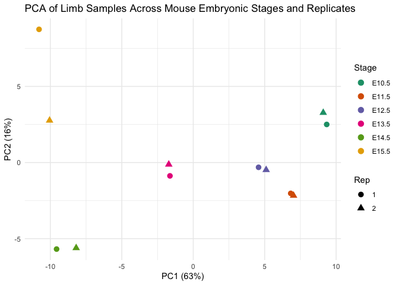
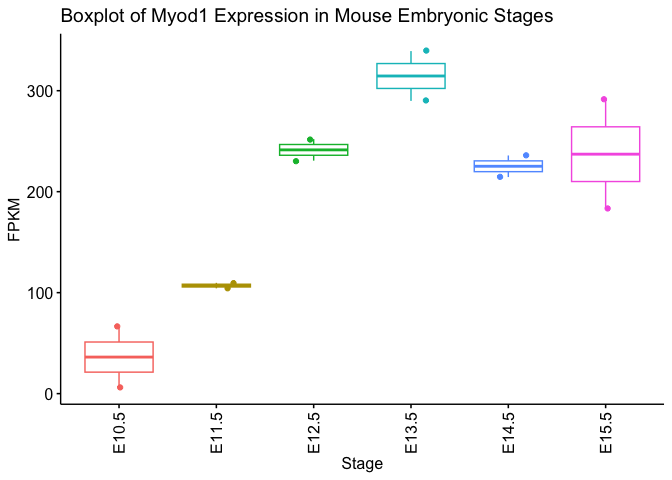
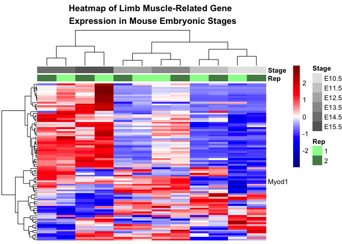

# Import libraries


``` r
library(edgeR)
library(matrixStats)
library(dplyr)
library(ggplot2)
library(GO.db)
library(biomaRt)
library(reshape2)
library(ggpubr)
library(pheatmap)
library(ggplotify)
library(svglite)
```

# Metadata table creation


``` r
meta <- read.delim("metadata.tsv", header = TRUE, sep = "\t")
meta$Stage <- c(rep("E15.5", 2), rep("E12.5", 4), rep("E10.5", 4), 
                  rep("E13.5", 2), rep("E11.5", 4), rep("E14.5", 4))
meta <- meta[, c("File.accession", "Stage", "Experiment.accession", "Biological.replicate.s.", "Technical.replicate.s.")]
meta <- meta %>%
  mutate(Samples = paste0(Stage, "_", Biological.replicate.s.))
head(meta)
```

```
##   File.accession Stage Experiment.accession Biological.replicate.s.
## 1    ENCFF246JLP E15.5          ENCSR347SQR                       1
## 2    ENCFF419QRX E15.5          ENCSR347SQR                       2
## 3    ENCFF479HKB E12.5          ENCSR750YSX                       2
## 4    ENCFF409ZNA E12.5          ENCSR750YSX                       1
## 5    ENCFF237SXT E12.5          ENCSR750YSX                       2
## 6    ENCFF262CIY E12.5          ENCSR750YSX                       1
##   Technical.replicate.s. Samples
## 1                    1_1 E15.5_1
## 2                    2_1 E15.5_2
## 3                    2_1 E12.5_2
## 4                    1_1 E12.5_1
## 5                    2_1 E12.5_2
## 6                    1_1 E12.5_1
```

# Read counts table


``` r
counts <- read.table(file = "counts/counts.txt",sep="\t",header=T,dec=".", stringsAsFactors = F)
colnames(counts) <- gsub("aligned.t_","",colnames(counts))
colnames(counts) <- gsub(".fastqAligned.sortedByCoord.out.bam","",colnames(counts))

ann <- counts[,c(1:6)] #STAR annotations for each gene
p_mat <- as.matrix(counts[,7:ncol(counts)]) #pre-matrix of counts
colnames(p_mat) <- meta$Samples[match(colnames(p_mat), meta$File.accession)]
```

# Counts matrix preparation
Technical replicates need to be joined, we will do it calculationg its mean to create a new column for each biological replicate. Then we will also create **cond** to store samples conditions.


``` r
uq_cols <- unique(colnames(p_mat))
mat <- matrix(nrow = nrow(p_mat), ncol = length(unique(uq_cols)))
colnames(mat) <- unique(uq_cols) 

for (col in uq_cols) {
  col_id <- which(colnames(p_mat) == col) 
  if (length(col_id) > 1) {
    mat[, col] <- rowMeans(p_mat[, col_id])
  } else {
    mat[, col] <- p_mat[, col_id] 
  }
}
rownames(mat) <- counts$Geneid

#Table to store samples conditions: biological replicate and stage of development
Cond <- data.frame(
    Rep = as.factor(sub(".*_(\\d+)$", "\\1", colnames(mat))),   
    Stage = as.factor(sub("(E\\d+\\.\\d).*", "\\1", colnames(mat))) 
)
rownames(Cond) <- colnames(mat)
table(Cond)
```

```
##    Stage
## Rep E10.5 E11.5 E12.5 E13.5 E14.5 E15.5
##   1     1     1     1     1     1     1
##   2     1     1     1     1     1     1
```

As we did the alignment against chr 7, we will subset the annotations and counts matrix.


``` r
chr7_ann <- ann %>% filter(grepl("(^|;)7(;|$)", Chr) & !grepl("17", Chr))
chr7_mat <- mat[match(chr7_ann$Geneid, rownames(mat)), , drop = F]
```

## Visualization of library sizes
Now we can check the number of counts per sample:


``` r
sample.totals <- colSums(mat)
sample.totals <- data.frame(Sample = names(sample.totals), Counts = sample.totals)
summary(sample.totals)
```

```
##     Sample              Counts       
##  Length:12          Min.   :1851497  
##  Class :character   1st Qu.:2296412  
##  Mode  :character   Median :2521018  
##                     Mean   :2757342  
##                     3rd Qu.:3211452  
##                     Max.   :4737913
```

``` r
sample.totals_7 <- colSums(chr7_mat)
sample.totals_7 <- data.frame(Sample = names(sample.totals_7), Counts = sample.totals_7)
summary(sample.totals_7)
```

```
##     Sample              Counts       
##  Length:12          Min.   :1851497  
##  Class :character   1st Qu.:2296412  
##  Mode  :character   Median :2521018  
##                     Mean   :2757342  
##                     3rd Qu.:3211452  
##                     Max.   :4737913
```

``` r
ggplot(sample.totals, aes(x = Sample, y = Counts)) +
       geom_bar(stat = "identity", fill = "skyblue", color = "skyblue2") +
       geom_text(aes(label = paste0(round(Counts / 1000, digits = 1), "K")), 
              position = position_stack(vjust = 0.5), angle = 90, size = 3) +
       labs(title = "Barplot of Total Counts per Sample") +
       theme_light() +
       theme(axis.text.x = element_text(angle = 90, hjust = 1)) 
```

<!-- -->

``` r
ggplot(sample.totals_7, aes(x = Sample, y = Counts)) +
       geom_bar(stat = "identity", fill = "pink", color = "pink2") +
       geom_text(aes(label = paste0(round(Counts / 1000, digits = 1), "K")), 
              position = position_stack(vjust = 0.5), angle = 90, size = 3) +
       labs(title = "Barplot of Total Counts per Sample - chr 7") +
       theme_light() +
       theme(axis.text.x = element_text(angle = 90, hjust = 1)) 
```

<!-- -->

# Normalization


``` r
d <- DGEList(counts = chr7_mat)
cpm <- cpm(chr7_mat, log = F); dim(cpm); cpm <- cpm[rowSums(cpm) > 0, ]; dim(cpm)
```

```
## [1] 4714   12
```

```
## [1] 3714   12
```

``` r
fpkm <- rpkm(chr7_mat, gene.length = chr7_ann$Length,log = F); dim(fpkm); fpkm <- fpkm[rowSums(fpkm) > 0, ]; dim(fpkm)
```

```
## [1] 4714   12
```

```
## [1] 3714   12
```

# PCA plot 


``` r
top100 <- head(order(rowVars(cpm), decreasing = T), 100)
pca <- prcomp(t(fpkm[top100,]), center = T, scale = T)
summary(pca)
```

```
## Importance of components:
##                           PC1    PC2    PC3    PC4     PC5     PC6    PC7
## Standard deviation     7.7157 4.0258 3.6687 2.0809 1.70926 1.19820 1.0535
## Proportion of Variance 0.5953 0.1621 0.1346 0.0433 0.02922 0.01436 0.0111
## Cumulative Proportion  0.5953 0.7574 0.8920 0.9353 0.96450 0.97886 0.9900
##                            PC8     PC9    PC10    PC11      PC12
## Standard deviation     0.63630 0.58408 0.38581 0.33044 5.434e-15
## Proportion of Variance 0.00405 0.00341 0.00149 0.00109 0.000e+00
## Cumulative Proportion  0.99401 0.99742 0.99891 1.00000 1.000e+00
```

``` r
ggplot(data = as.data.frame(pca$x), aes(x = PC1, y = PC2)) +
  geom_point(size = 3, aes(shape = Cond$Rep, color = Cond$Stage)) + 
  labs(title = "PCA of Limb Samples Across Mouse Embryonic Stages and Replicates", 
       x = paste0("PC1 (",round(summary(pca)$importance[2,"PC1"]*100),"%)"), 
       y = paste0("PC2 (",round(summary(pca)$importance[2,"PC2"]*100),"%)"), 
       shape = "Rep", color = "Stage") + 
    theme_minimal() +
  scale_color_brewer(palette = "Dark2")
```

<!-- -->

# Data visualization
## Myod1 expression boxplot


``` r
myod.df <- as.data.frame(t(fpkm["Myod1",]))
n <- reshape2::melt(myod.df)
n$Cond <- Cond$Stage

ggboxplot(n, x = "Cond", y = "value",
          color = "Cond",
          xlab = "Stage", ylab = "FPKM", add = "jitter", 
          title = "Boxplot of Myod1 Expression in Mouse Embryonic Stages") +
          guides(color = F) +
          rotate_x_text()
```

<!-- -->

## Heatmap of muscle-related genes
### Selection of muscle-related genes


``` r
xx <- as.list(GOTERM)
terms <- lapply(xx, Term)
muscle_terms <- grep("muscle", terms, ignore.case = T)
muscle_terms <- unlist(terms[muscle_terms])

ensembl <- useMart("ENSEMBL_MART_ENSEMBL", dataset = "mmusculus_gene_ensembl")
muscle_genes <- getBM(attributes = c("external_gene_name", "go_id"),
                     filters = "go", values = names(muscle_terms), mart = ensembl)

m_fpkm <- fpkm[rownames(fpkm) %in% unique(muscle_genes$external_gene_name), ]
dim(m_fpkm)
```

```
## [1] 86 12
```

### Heatmap


``` r
cols <- list(
  Stage = c("E10.5" = "gray90",
           "E11.5" = "gray80",
           "E12.5" = "gray70",
           "E13.5" = "gray60",
           "E14.5" = "gray50",
           "E15.5" = "gray40"),
  Rep = c("1" = "palegreen",
          "2" = "palegreen4")
)
heatcol<-colorRampPalette(c("darkblue", "blue", "white","red", "darkred"), space = "rgb")
row_labs <- ifelse(rownames(m_fpkm) == "Myod1", "Myod1", "")

pheatmap(m_fpkm, 
         col = heatcol(256), border_color = NA,
         cluster_rows = T, clustering_method = "ward.D2", clustering_distance_cols = "euclidean", 
         scale = "row", 
         main = "Heatmap of Limb Muscle-Related Gene \n Expression in Mouse Embryonic Stages", 
         cexRow = 0.5, cexCol = 0.8, 
         show_colnames = F, labels_row = row_labs,
         annotation_col = Cond, annotation_colors = cols)
```

<!-- -->
