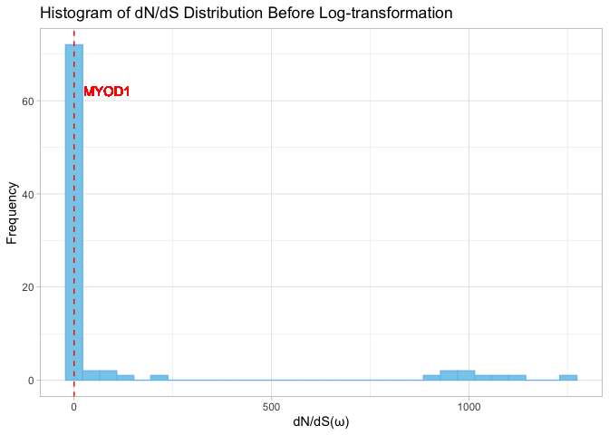
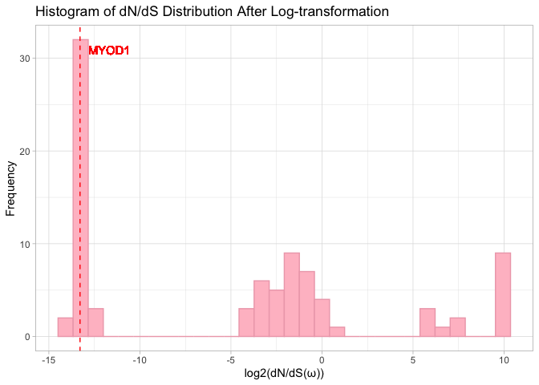
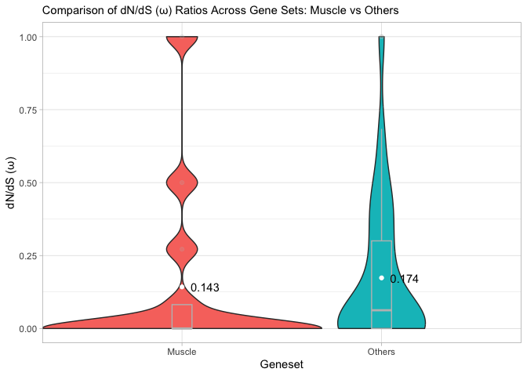

In this markdown we are going to compare the dN/dS values of MyoD1 with the rest of the bHLH TFs. This way we can have an estimate of the selection pressure on the coding sequence of MyoD1.


# Import libraries


``` r
library(dplyr)
library(naniar)
library(ggplot2)
library(GO.db)
library(biomaRt)
library(ggpubr)
library(pheatmap)
```

# Read the data


``` r
data <- read.table("HumanTFs_DBD.txt", header = T, row.names = 1, sep = "\t")
dnds <- read.table("HumanDnDsW.txt", header = T,  sep = "\t")

bHLH_data <- left_join(data[data$DBD == "bHLH",], dnds, by=c("Ensembl.ID"="GeneID"))
head(bHLH_data)
```

```
##        Ensembl.ID HGNC.symbol  DBD Homo_sapiens.dN Homo_sapiens.dS
## 1 ENSG00000106546         AHR bHLH        0.003313        0.015554
## 2 ENSG00000063438        AHRR bHLH        0.003798        0.003045
## 3 ENSG00000143437        ARNT bHLH        0.001339        0.005698
## 4 ENSG00000172379       ARNT2 bHLH        0.000001        0.009266
## 5 ENSG00000133794       ARNTL bHLH        0.000000        0.000005
## 6 ENSG00000029153      ARNTL2 bHLH        0.001614        0.002360
##   Homo_sapiens.dw Homo_sapiens.w
## 1         -0.1922    0.212999871
## 2          0.9250    1.247290640
## 3          0.1680    0.234994735
## 4         -0.0167    0.000107921
## 5         -0.0111    0.000100000
## 6          0.4939    0.683898305
```

# Data inspection


``` r
summary(bHLH_data)
```

```
##   Ensembl.ID        HGNC.symbol            DBD            Homo_sapiens.dN   
##  Length:112         Length:112         Length:112         Min.   :0.000000  
##  Class :character   Class :character   Class :character   1st Qu.:0.000001  
##  Mode  :character   Mode  :character   Mode  :character   Median :0.000002  
##                                                           Mean   :0.002448  
##                                                           3rd Qu.:0.002138  
##                                                           Max.   :0.104688  
##                                                           NA's   :25        
##  Homo_sapiens.dS    Homo_sapiens.dw     Homo_sapiens.w     
##  Min.   :0.000000   Min.   :-998.9999   Min.   :   0.0001  
##  1st Qu.:0.000005   1st Qu.:  -0.0522   1st Qu.:   0.0001  
##  Median :0.004085   Median :   0.0000   Median :   0.1008  
##  Mean   :0.011553   Mean   :  87.6290   Mean   : 113.9028  
##  3rd Qu.:0.013210   3rd Qu.:   0.4674   3rd Qu.:   0.5956  
##  Max.   :0.363157   Max.   : 998.9999   Max.   :1251.0000  
##  NA's   :25         NA's   :25          NA's   :25
```

``` r
vis_miss(bHLH_data)
```

<!-- -->

``` r
#bHLH_data <- bHLH_data %>%
#  filter(!is.na(Homo_sapiens.dN) & !is.na(Homo_sapiens.dS) & !is.na(Homo_sapiens.w))
bHLH_data$Homo_sapiens.w[bHLH_data$HGNC.symbol == "MYOD1"]
```

```
## [1] 1e-04
```


``` r
s <- bHLH_data[bHLH_data$HGNC.symbol %in% c("MYOD1", "NEUROG2", "NEUROD2", "ASCL1", "OLIG2", "PTF1A", "ATOH1"), c("Homo_sapiens.dN", "Homo_sapiens.dS", "Homo_sapiens.w"), drop = FALSE]
rownames(s) <- bHLH_data[bHLH_data$HGNC.symbol %in% c("MYOD1", "NEUROG2", "NEUROD2", "ASCL1", "OLIG2", "PTF1A", "ATOH1"), "HGNC.symbol"]
colnames(s) <- c("dN", "dS", "ω")
pheatmap(scale(s), cluster_rows = FALSE, cluster_cols = FALSE, color = colorRampPalette(c("blue", "white", "red"))(50), na_col = "#DDDDDD")
```

<!-- -->


# Data log-transformation


``` r
hist(bHLH_data$Homo_sapiens.w, main = "dN/dS Distribution", xlab = "dN/dS", breaks = 30, col = "#8EEE8B")
```

<!-- -->

``` r
bHLH_data$Homo_sapiens.w.log2 <- log2(bHLH_data$Homo_sapiens.w)
hist(bHLH_data$Homo_sapiens.w.log2, main = "dN/dS Distribution", xlab = "dN/dS", breaks = 30, col = "#8EEE8B")
```

<!-- -->

# Data visualization

MyoD1 dN/dS (ω) rato is 1e-04.


``` r
ggplot(bHLH_data, aes(x = HGNC.symbol, y = Homo_sapiens.w.log2)) +
  geom_bar(stat = "identity", aes(fill = HGNC.symbol == "MYOD1")) +  
  scale_fill_manual(values = c("#68B0F8", "#C968F8"), guide = "none") +  
  labs(title = "Bar plot of dN/dS (ω) values from bHLH family members", y = "dN/dS (ω)", x = "bHLH transcription factors") +
  theme_bw() + 
  scale_x_discrete(breaks = bHLH_data$HGNC.symbol[seq(1, nrow(bHLH_data), by = 2)], labels = function(x) {ifelse(x == "MYOD1", expression(bold("MYOD1")), x)}) +
  theme(axis.text.x = element_text(hjust = 1, size = 10), axis.text.y = element_text(size = 10))+
  rotate_x_text(angle = 90)
```

<!-- -->

# dN/dS comparison using GO terms containing "muscle"


``` r
xx <- as.list(GOTERM)
terms <- lapply(xx, Term)
muscle_terms <- grep("muscle", terms, ignore.case = TRUE)
muscle_terms <- unlist(terms[muscle_terms])

ensembl = useMart(biomart="ensembl", dataset="hsapiens_gene_ensembl")
muscle_gene <- getBM(attributes=c('ensembl_gene_id', "go_id"),
                     filters = 'go', values = names(muscle_terms), mart = ensembl)

df_muscle <- filter(bHLH_data, Ensembl.ID %in% unique(muscle_gene$ensembl_gene_id))

df_muscle$Geneset <- "Muscle"
bHLH_data$Geneset <- "Others"
df <- bHLH_data %>%
  rows_update(df_muscle, by = "Ensembl.ID")
head(df)
```

```
##        Ensembl.ID HGNC.symbol  DBD Homo_sapiens.dN Homo_sapiens.dS
## 1 ENSG00000106546         AHR bHLH        0.003313        0.015554
## 2 ENSG00000063438        AHRR bHLH        0.003798        0.003045
## 3 ENSG00000143437        ARNT bHLH        0.001339        0.005698
## 4 ENSG00000172379       ARNT2 bHLH        0.000001        0.009266
## 5 ENSG00000133794       ARNTL bHLH        0.000000        0.000005
## 6 ENSG00000029153      ARNTL2 bHLH        0.001614        0.002360
##   Homo_sapiens.dw Homo_sapiens.w Homo_sapiens.w.log2 Geneset
## 1         -0.1922    0.212999871          -2.2310755  Others
## 2          0.9250    1.247290640           0.3187977  Others
## 3          0.1680    0.234994735          -2.0892997  Others
## 4         -0.0167    0.000107921         -13.1777368  Others
## 5         -0.0111    0.000100000         -13.2877124  Muscle
## 6          0.4939    0.683898305          -0.5481463  Others
```

MyoD1, as the majority of proteins, seems to be under strong purifying selection. In the following violin plot bHLH members with biological functions related to muscle seem to have a lower ω rate compared to the members with other functions.


``` r
ggplot(df, aes(x=Geneset, y=Homo_sapiens.w , fill=Geneset)) +
  geom_violin(width=1.4) +
  geom_boxplot(width=0.1, color="grey", alpha=0.2) +
  labs(y = "dN/dS (ω)") +
  theme_light() +
  theme(legend.position="none", plot.title = element_text(size=11)) + 
  ylim(c(0,1)) +
  stat_summary(
    fun = "mean",
    geom = "point",
    color = "#fff"
  ) +
  stat_summary(
    fun = "mean",
    geom = "text",
    aes(label = round(..y.., 3)),
    hjust = -0.3,  
    color = "#000"
  )
```

<!-- -->
